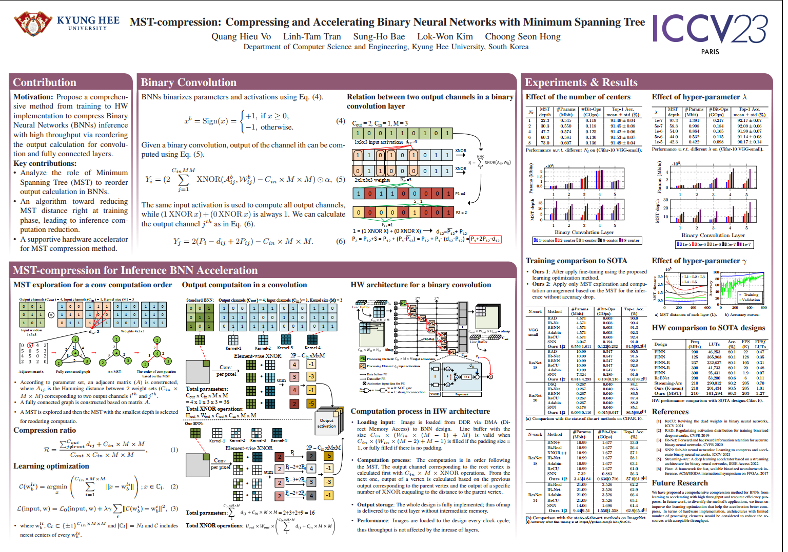

# LaTex Poster for Deep HDR Video Reconstruction (ICCV 2021)

## Poster Example

    

## Introduction
This code stores the LaTex source code for building the poster for "MST-compression: Compressing and Accelerating Binary Neural Networks with Minimum Spanning Tree" (ICCV 2023). This poster is based on "https://github.com/guanyingc/DeepHDRVideo_Poster_LaTex". You may try to design your own poster based on this example. Please refer to (http://www.brian-amberg.de/uni/poster/) for more examples and FAQ.

We provide poster examples in the landscape format.

- Open [poster_landscape.pdf](./poster_landscape.pdf) to see the built poster.

- Type `make` to rebuild the poster.
